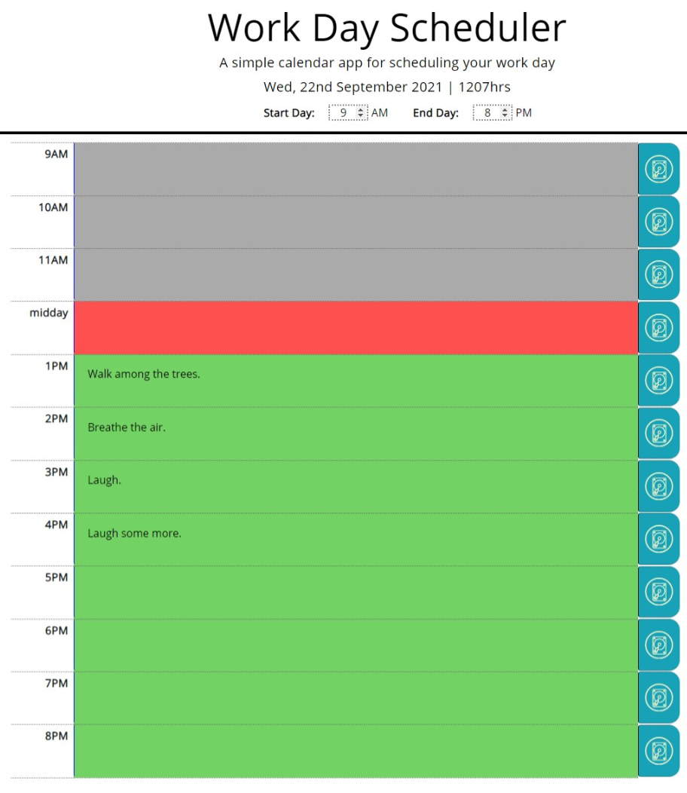

# USYD-FSF Week 5 Project
## Third-Party APIs: Work Day Scheduler

### Table of Contents  
  
   1. [Project Description](#1-description)
   2. [Application Features](#2-features)
   3. [Installation](#3-installation)
   4. [Usage](#4-usage)
   5. [Credits](#5-credits)
   6. [License](#6-license)
   7. [Repository Status](#7-github-repo-status)
   8. [Contribute](#8-how-to-contribute)
   9. [Tests](#9-tests)
   10. [Checklist](#10-checklist)

---
### 1. Description  
**What is this project?**  
* Create a simple calendar application that allows a user to save events for each hour of the day by modifying starter code. The app is to run in the browser and feature dynamically updated HTML and CSS powered by jQuery.

**Why this project?**  
* Create an application to test my knowledge on using JavaScript plugins like jQuery, Bootstrap and Moment.js.

**What problem does this project solve?**  
* Provides a simple daily task scheduler that can be used by anyone on any device. 

**Lessons learnt?**  
* I had a go at generating the table from JavaScript.  It caused me a lot of headaches as the jQuery references were not working as expected for the generated table.  I tried different solutions like delaying until I was sure DOM had loaded.  It didn't completely work so this app has both jQuery selectors and standard DOM selectors.  I did get to see the benefits of jQuery with this development however it was definitely giving me some headaches - also partly due to my basic knowledge  of it.

* Decided to have some fun and expand the functionality - who decides "standard work time"?  I decided the user should so I provided a simple tool for the user to expand and contract the day's start and end time.

* Also added dynamic time block shading so that if the user happens to be looking at the app at 1 minute before the hour they will most likely get to witness the shading updating itself!  I learnt that little things like this and the work involved to create it is most likely missed by the average user.  That said, I got enjoyment coming up with the idea and implementing it.  I did it at little processing expense as you'll see I tied it into the current clock so that whenever the clock minutes = 0 then that is time to refresh the page.  I've not tested to see if it interferes should a user be typing in a task at the same time however I'm expecting the user might need to just click back into the cell to continue typing.  Needs to be tested.

* Also provided better functionality - deleting messages can be donen by right clicking the save button.  Also I set up an autosave when a user either tabs or changes focus to another hour.

---
### 2. Features  
Client requested features as implemented:  
- daily scheduler that has colour coded time blocks showing which hours are past, present and future;
- any tasks entered are saved in the local storage and persist when the page is reloaded or opened at another time in the future (i.e. providing the user has not cleared their local storage); and
- well presented task scheduler that is based on simplicity and effectiveness.

#### The webpage

 

---
### 3. Installation  
You can download the source code from [my Github repository](https://github.com/Mark33Mark/workday-scheduler) and open the index.html file to review the website inside your selected web browser.  
Alternatively, the webpage has also been hosted via [URL: task.watsonised.com](https://task.watsonised.com)

---
### 4. Usage  
The code is available from [my Github repository](https://github.com/Mark33Mark/workday-scheduler) with all assets created for the project.  
Once you've downloaded, you can modify the code as you need.

---
### 5. Credits  
No specific references here apart from the different activities I've completed to date as part of the course this work has been done for.

---
### 6. License  
 The works in this repository are subject to:  

---
### 7. Github repo status  

---
### 8. How to Contribute
 If you would like to contribute, please comply with the Contributor Covenant Code of Conduct:  

---
### 9. Tests  
- Tested on a desktop computer, Samsung Note 10+ and laptop computer. Also reviewed the app in the browser's developer tool's mobile phone emulator.  As far as I observed, the app is responsive and functioning well across all devices.  The workday time band on mobiles needs to have the number typed in as the spin buttons do not appear on mobile phones.

---
### 10. Checklist  
 All actions not checked are still to be completed:
  * [x]  As an employee, I can add events to a daily planner to manage my time more effectively.
  * [x]  When the planner is opened, the current day is displayed at the top of the calendar.  All time functions are from the Moment.js.
  * [x]  When the user scrolls down, they are presented withi timeblocks for standard business hours.
  * [x]  When timeblocks are viewed, each block is colour coded to indicate if it is in the past, present or future.
  * [x]  The user can click into a timeblock and enter an event.
  * [x]  Clicking the save button for the timeblock saves the event in local storage.
  * [x]  Using local storage has the entered tasks persisting if the page is refreshed or closed and open again.
  * [x]  The application user experience is intuitive and easy to navigate.  The user interface style is clean and polished.
  * [x]  The application resembles the mock-up functionality provided in the homework instructions.
  * [x]  Deployed at live URL, [website](https://task.watsonised.com) 
  * [x]  Application loads with no errors when inspected with Chrome DevTools.
  * [x]  Github repository contains application code [Github location](https://github.com/Mark33Mark/workday-scheduler)
  * [x]  Repository has a unique name; follows best practice for file structure; and naming conventions.
  * [x]  Repsository follows best practices for class/id naming conventions, indentation, quality comments, etc.
  * [x]  Repository contains multiple descriptive commit messages.
  * [x]  Repository contains a README file with description, screenshot and link to deployed application.
---

- [Back to the top](#usyd-fsf-week-5-project)